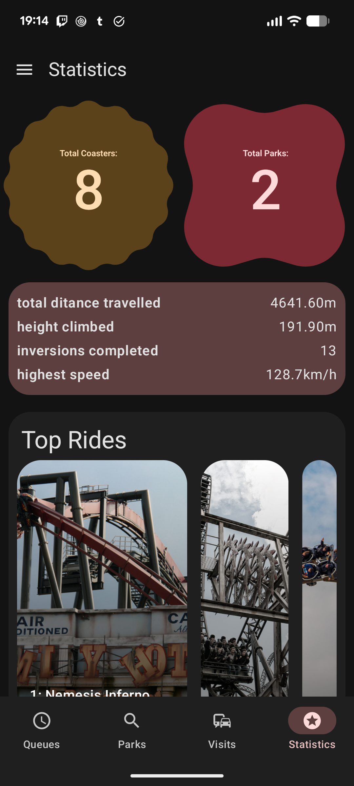
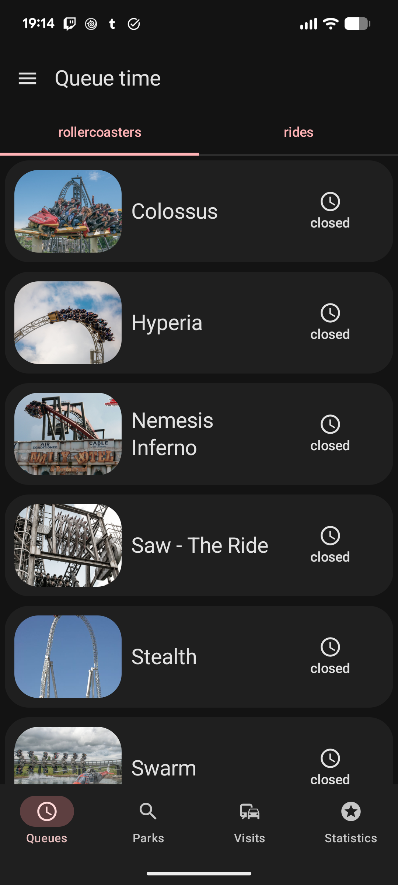

# Introduction

Coaster Track is an android app for checking queue times at theme parks, as well as tracking and
ranking rides and rollercoasters. Coaster Track is built in Kotlin with Jetpack Compose and sources
queue time data from [Queue-Times.com](https://queue-times.com).

# Features

- view live queue times from over 100 parks
- view ride information for rollercoasters at these parks
- track and rank rollercoasters
- UI built to Material 3 guidelines

# Screenshots

# Requirements

- Android device with android 9 or above

# Installation

the apk can be found in [releases](https://github.com/Sammy-The-Fish/CoasterTrack/releases)

# Known Bugs

- park images ParkLookupScreen do not load before query is typed
- parks with no rollercoasters do not load
